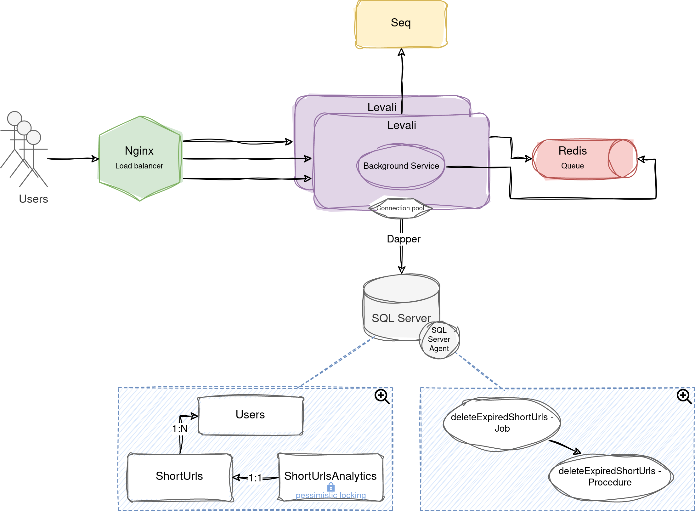

# Levali-UrlShortener

Levali is a URL shortener that counts clicks.

## Features
- [x] URL shortening;
- [x] Click count;
- [x] URLs expiration;
- [x] Lazy removal of expired URLs from the database;
- [x] Periodically run a job to remove expired URLs from the database.

## System Design
<p align="center">
   
</p>

## How to use?
After cloning the project to your machine you can use the following commands:
```bash
# Run application
$ docker-compose up --build --scale api=2

# Configure database
$ docker exec -it levali-sqlserver bash
$ cd docker-entrypoint-initdb.d/ && ./init-db.sh && exit

# Stop application
$ [Ctrl] + c
$ docker-compose down
```

## Endpoints
[Postman collection](https://github.com/isaac-allef/Levali-UrlShortener/blob/main/assets/levali-postman-collection.json "download")

---
Made by Isaac Allef :wave:
